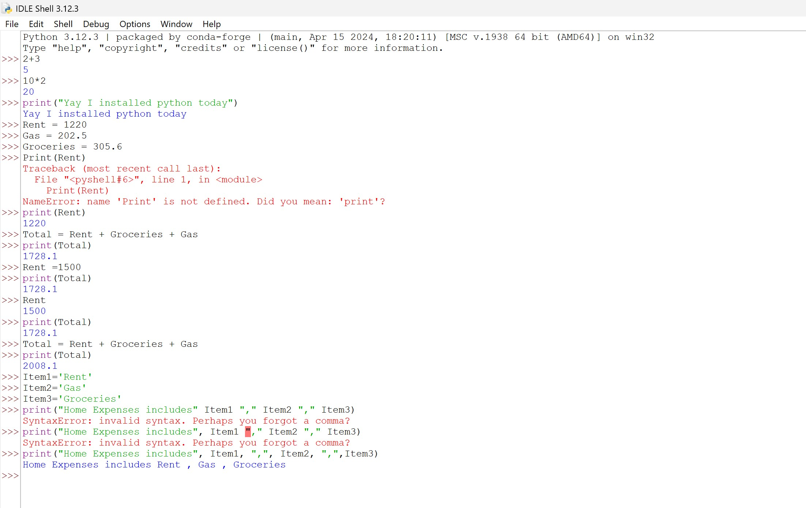

## Topic

### Variables and Basic Operations

This section introduces Python variables and demonstrates how they are used to store different types of data and perform simple computations.

---

## Concepts Covered

- Creating variables
- Numeric data types
- String variables
- Arithmetic operations
- Updating variable values
- Using the `print()` function
- Combining variables
- Displaying multiple values
- Understanding and fixing common syntax errors

---

## Example

### Defining Variables

```python
Rent = 1220
Gas = 202.5
Groceries = 305.6
```

### Calculating Total Expenses

```python
Total = Rent + Gas + Groceries
print(Total)
```

**Output**

```
1728.1
```

---

### Updating Variable Values

```python
Rent = 1500
Total = Rent + Gas + Groceries
print(Total)
```

**Output**

```
2008.1
```

---

### Working with Strings

```python
Item1 = "Rent"
Item2 = "Gas"
Item3 = "Groceries"

print("Home Expenses includes", Item1, ",", Item2, ",", Item3)
```

**Output**

```
Home Expenses includes Rent, Gas, Groceries
```

---

## Learning Notes

During this exercise I learned:

- Variable names are case-sensitive.
- `print()` must be written in lowercase.
- Variables can be updated at any time.
- Existing calculations are not updated automatically after changing a variable—you need to recalculate them.
- Multiple values can be printed in a single `print()` statement using commas.

---

## Common Mistakes Encountered

### Incorrect

```python
Print(Rent)
```

Error

```
NameError: name 'Print' is not defined
```

Correct

```python
print(Rent)
```

---

### Missing Comma

Incorrect

```python
print("Home Expenses", Item1 " ", Item2)
```

Correct

```python
print("Home Expenses", Item1, ",", Item2)
```

---

## Screenshot

The following screenshot shows the interactive Python IDLE session used while practicing these concepts.



---
